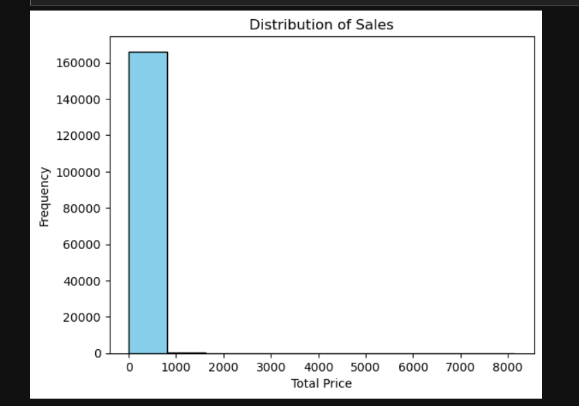
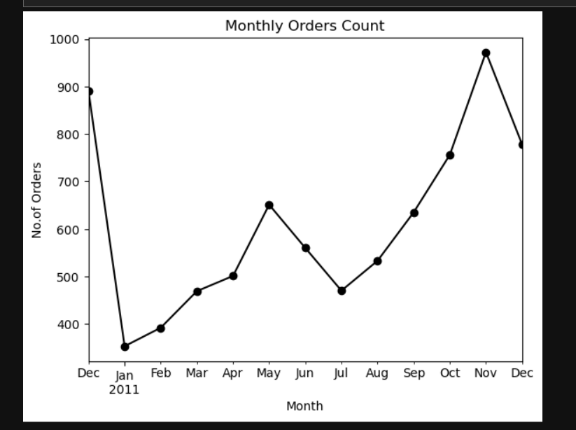
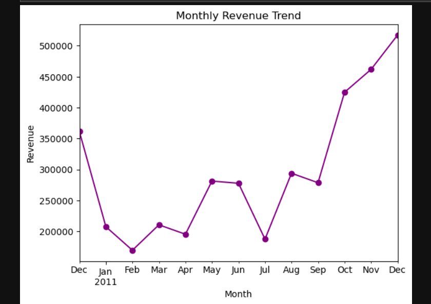
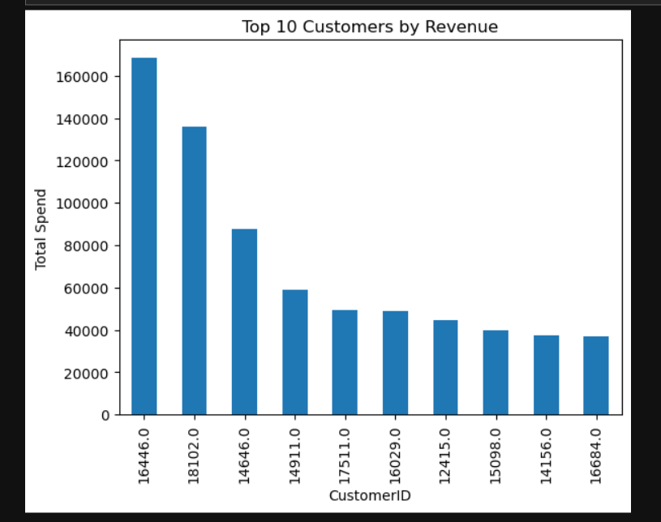
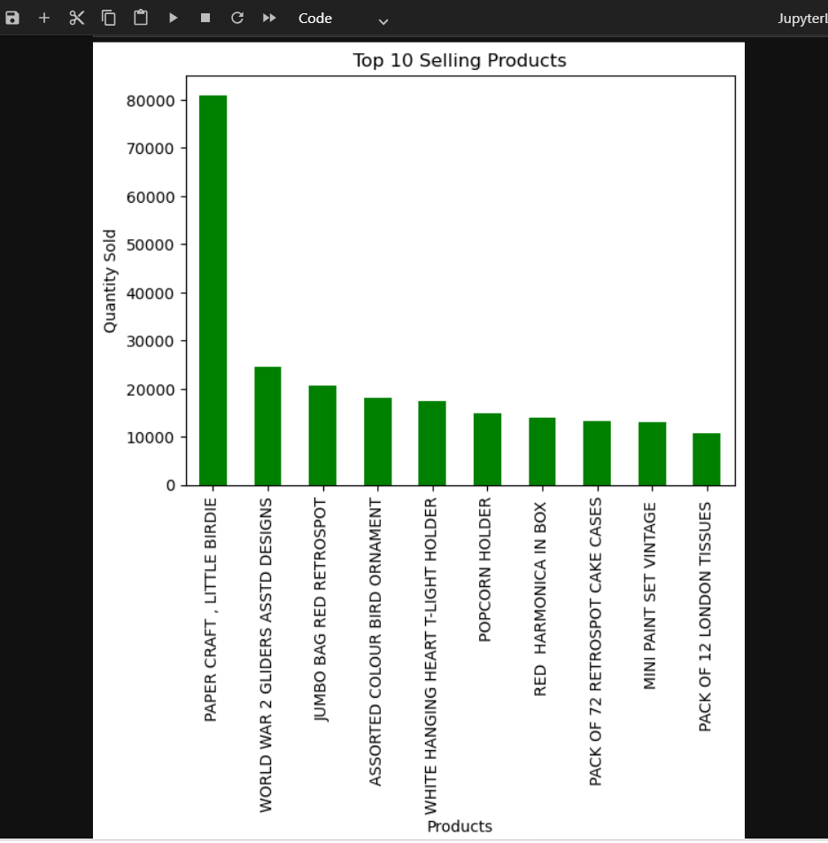
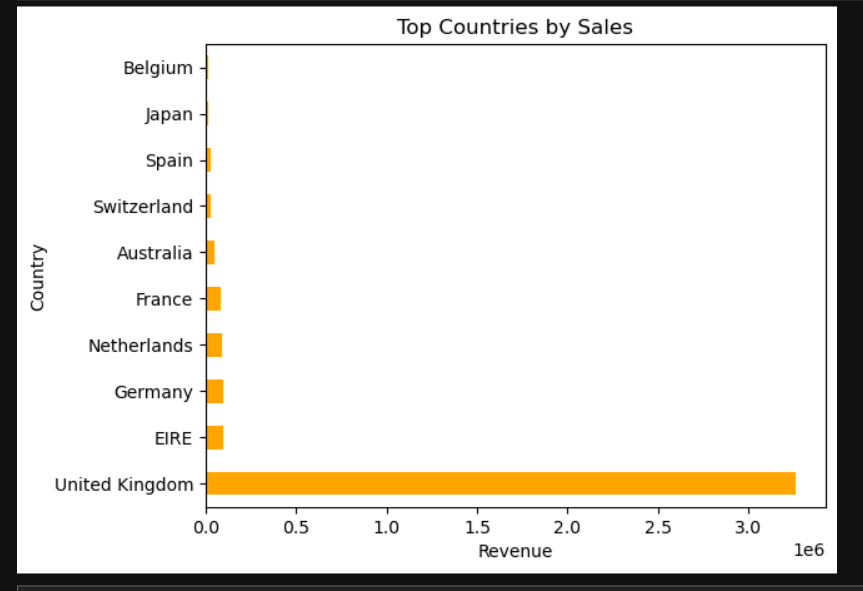

# E-commerce-data-cleaning-analysis-Python-Pandas-
E-Commerce Data Analysis using Pandas and Matplotlib
This project analyzes an e-commerce dataset using Python to uncover sales patterns, customer behavior, and business insights. The analysis includes data cleaning, feature engineering, exploratory data analysis(EDA), and visualization.
# Objectives
1. Perform data cleaning and preprocessing
2. Analyze sales trend over time
3. Identify top customers and products
4. Understand purchasing patterns
5. Generate business insights
# Tool Used
Python 
Pandas 
Numpy
Matplotlib (Visualizations)
Jupter Notebook
# Dataset 
Transactional dataset containing:
1.InvoiceNo,StockCode,Description
2.Quantity,InvoiceDate,UnitPrice
3.CustomerID,Country
# Data Cleaning 
1.Removed deuplicates
2.Handling missing values
3.Coverted date format
4.Removed invalid values(negative quantity & price)
# Feature Engineering 
 Created TotalPrice = Quantity * UnitPrice
 Extracted Year and Month
 
 # Visualizations
 ## Distribution by Sales
 
 ## Monthly Orders Count
 
 ## Monthly Trends
 
 ## Top 10 Customers
 
 ## Top 10 Products
 
 ## Top Countries
 
 
 # Key Insights 
 1. Strong seasonal sales pattern
 2. Revenue driven by few customers
 3. Majority of transactions are low-value
 4. Geographic concentration of sales
# Conclusion 
This project demonstrates how pandas can be used for data cleaning, analysis and visualization to derive actionable business insights.
